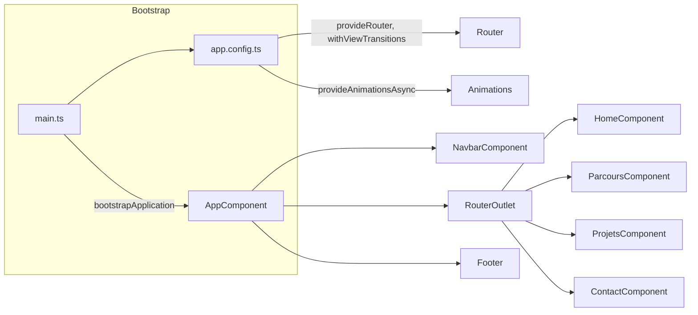
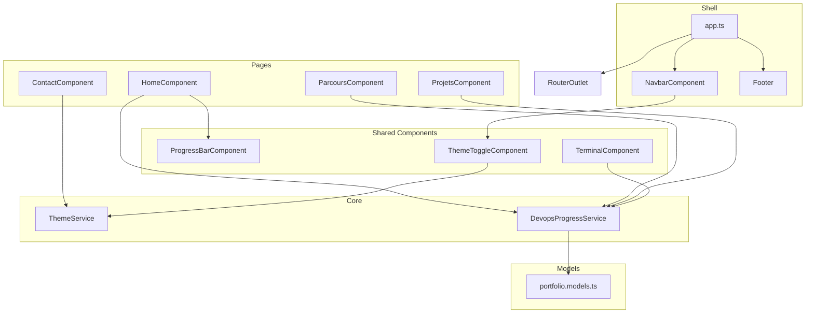

# Documentation technique — Portfolio DevOps

## 1. Introduction

### 1.1 Présentation du projet

**portfolio-devops** est une application web de type portfolio personnel, centrée sur une progression en **DevOps**. Elle présente de manière visuelle et évolutive un parcours de formation et des réalisations (Linux, Docker, AWS, CI/CD), avec une identité visuelle inspirée du terminal (polices monospace, couleurs type « terminal », thème sombre par défaut).

**Objectifs :**

- Mettre en avant les compétences et la roadmap DevOps (Linux → Docker → AWS → CI/CD).
- Présenter les projets, le parcours (stages, formations) et un moyen de contact.
- Servir de vitrine technique déployable en statique (ex. AWS S3).

**Public cible :** recruteurs, équipes techniques, et toute personne souhaitant découvrir le profil et la progression DevOps du porteur du projet.

### 1.2 Architecture en bref

L’application est une **SPA (Single Page Application) Angular 20** basée sur les **composants standalone**, l’état réactif via les **Signals**, et le style **Tailwind CSS**. Les vues sont chargées en **lazy loading** et les transitions de route sont gérées par le routeur Angular.

---

## 2. Stack technique et prérequis

### 2.1 Tableau récapitulatif

| Technologie        | Version   | Rôle |
|--------------------|-----------|------|
| Angular            | 20.x      | Framework applicatif |
| TypeScript         | 5.8.x     | Langage |
| Tailwind CSS       | 3.4.x     | Styles utilitaires et thème |
| SCSS               | —         | Styles globaux et composants |
| RxJS               | 7.8.x     | Programmation réactive (dépendance Angular) |
| Zone.js            | 0.15.x    | Détection des changements (Angular) |

### 2.2 Prérequis

- **Node.js** : >= 20
- **Angular CLI** : compatible avec le projet (voir `package.json` et `ng version`)
- **npm** : pour l’installation des dépendances

### 2.3 Référence des dépendances

Les dépendances exactes sont définies dans [package.json](package.json) :

- **dependencies** : `@angular/*` (core, common, compiler, forms, platform-browser, router), `rxjs`, `tslib`, `zone.js`
- **devDependencies** : `@angular-devkit/build-angular`, `@angular/cli`, `@angular/compiler-cli`, `@tailwindcss/forms`, `autoprefixer`, `postcss`, `tailwindcss`, `typescript`

---

## 3. Architecture de l’application

### 3.1 Flux de démarrage



### 3.2 Couches fonctionnelles



- **Shell** : structure globale (navbar, outlet, footer) définie dans [src/app/app.ts](src/app/app.ts).
- **Pages** : vues principales (Accueil, Parcours, Projets, Contact), chargées via le routeur.
- **Shared** : composants réutilisables (barre de progression, widget terminal, bouton thème).
- **Core** : services injectables (thème, données DevOps).
- **Models** : interfaces TypeScript partagées.

---

## 4. Structure des dossiers

```
src/
├── main.ts                    # Point d'entrée : bootstrapApplication(AppComponent, appConfig)
├── index.html                 # HTML racine, polices, body
├── app/
│   ├── app.config.ts          # Providers : Router, ViewTransitions, Animations
│   ├── app.routes.ts          # Définition des routes et lazy loading
│   ├── app.ts                 # Composant racine (navbar + router-outlet + footer)
│   ├── core/
│   │   └── services/
│   │       ├── devops-progress.service.ts   # Données skills, projets, timeline (Signals)
│   │       └── theme.service.ts             # Thème dark/light + localStorage
│   ├── shared/
│   │   └── components/
│   │       ├── navbar/        # Barre de navigation fixe, menu mobile
│   │       ├── terminal/      # Widget terminal animé
│   │       ├── progress-bar/  # Barre de progression réutilisable
│   │       └── theme-toggle/   # Bouton bascule thème
│   ├── pages/
│   │   ├── home/              # Hero + roadmap DevOps
│   │   ├── parcours/          # Timeline stage / formation
│   │   ├── projets/            # Grille de projets avec filtres
│   │   └── contact/            # Formulaire de contact + liens sociaux
│   └── models/
│       └── portfolio.models.ts # Interfaces DevOpsSkill, Project, TimelineItem
└── styles/
    └── global.scss            # Tailwind + couches base/components/utilities
```

**Points d’entrée principaux :**

- [src/main.ts](src/main.ts) : bootstrap de l’application.
- [src/app/app.config.ts](src/app/app.config.ts) : configuration (routeur, transitions, animations).
- [src/app/app.ts](src/app/app.ts) : composant racine avec navbar, `RouterOutlet` et footer.

Les assets statiques (images, favicon) sont servis depuis le dossier **public/** (configuré dans `angular.json`).

---

## 5. Modèles de données

Toutes les interfaces sont définies dans [src/app/models/portfolio.models.ts](src/app/models/portfolio.models.ts).

### 5.1 DevOpsSkill et SkillStatus

Représente une compétence de la roadmap DevOps (Linux, Docker, AWS, etc.).

| Champ        | Type          | Description |
|-------------|---------------|-------------|
| `id`        | `string`      | Identifiant unique |
| `name`      | `string`      | Nom affiché |
| `icon`      | `string`      | Emoji ou icône |
| `description` | `string`    | Texte descriptif |
| `progress`  | `number`      | Pourcentage 0–100 |
| `status`    | `SkillStatus` | État de la compétence |
| `tags`      | `string[]`    | Mots-clés techniques |
| `accentColor` | `string`    | Couleur d’accent (ex. hex) |
| `startedAt` | `string?`     | Date de début (optionnel, ex. "2024-01") |

**SkillStatus** : `'mastered' | 'learning' | 'coming' | 'planned'`

### 5.2 Project

Représente un projet (portfolio, app Dockerisée, etc.).

| Champ         | Type     | Description |
|---------------|----------|-------------|
| `id`          | `string` | Identifiant unique |
| `title`       | `string` | Titre du projet |
| `icon`        | `string` | Emoji ou icône |
| `description` | `string` | Description courte |
| `stack`       | `string[]` | Technologies utilisées |
| `githubUrl`   | `string?` | Lien dépôt GitHub (optionnel) |
| `demoUrl`     | `string?` | Lien démo (optionnel) |
| `status`      | `'done' \| 'in-progress' \| 'planned'` | État du projet |

### 5.3 TimelineItem

Élément de la timeline (stage, formation, certification).

| Champ         | Type     | Description |
|---------------|----------|-------------|
| `id`          | `string` | Identifiant unique |
| `date`        | `string` | Période affichée (ex. "2024 — Présent") |
| `title`       | `string` | Intitulé |
| `company`     | `string` | Entreprise ou organisme |
| `description` | `string` | Description |
| `type`        | `'stage' \| 'formation' \| 'certification'` | Type d’entrée |
| `active`      | `boolean` | Indique si l’entrée est « en cours » |
| `tags`        | `string[]` | Mots-clés |

---

## 6. Services (core)

### 6.1 ThemeService

**Fichier :** [src/app/core/services/theme.service.ts](src/app/core/services/theme.service.ts)

**Rôle :** Gestion du thème clair/sombre et persistance dans le navigateur.

- **État :** signal `theme` de type `'dark' | 'light'`, exposé en lecture seule.
- **Persistance :** clé `portfolio-theme` dans `localStorage`. Au démarrage, le service lit cette clé et initialise le signal.
- **Effet :** un `effect()` réagit aux changements de `theme` et applique la classe `dark` ou `light` sur `document.documentElement`, puis sauvegarde la valeur dans `localStorage`.
- **API :**
  - `isDark(): boolean` — indique si le thème actif est dark.
  - `toggle(): void` — bascule entre dark et light.

### 6.2 DevopsProgressService

**Fichier :** [src/app/core/services/devops-progress.service.ts](src/app/core/services/devops-progress.service.ts)

**Rôle :** Source unique des données affichées (skills, projets, timeline). Fourni à la racine (`providedIn: 'root'`).

- **Signals privés :** `_skills`, `_projects`, `_timeline` (tableaux typés).
- **API en lecture seule :** `skills`, `projects`, `timeline` (exposés via `.asReadonly()`).
- **Computed :** `globalProgress` — moyenne des champs `progress` de tous les skills, arrondie (utilisée sur la page d’accueil).
- **Données exposées :**
  - **Skills :** Linux, Docker, AWS, CI/CD, Kubernetes, Angular (avec progress, status, tags, accentColor).
  - **Projects :** portfolio Angular, app Dockerisée, infra AWS, pipeline CI/CD (avec stack, githubUrl, status).
  - **Timeline :** stages, formations (dates, company, type, active, tags).

Pour modifier la progression ou ajouter un projet/skill, éditer les tableaux initialisant ces signals dans ce service.

---

## 7. Composants partagés

### 7.1 NavbarComponent

**Fichier :** [src/app/shared/components/navbar/navbar.component.ts](src/app/shared/components/navbar/navbar.component.ts)

- Barre de navigation **fixe** en haut (`fixed top-0`), avec fond semi-transparent et bordure.
- **Logo** : lien vers `/` avec le texte « dev.ops_ ».
- **Liens desktop :** Accueil, Parcours, Projets, Contact avec `RouterLink` et `RouterLinkActive` (classe `text-green-400` sur le lien actif).
- **Badge** : « En stage · DevOps » avec point animé (visible à partir de `sm`).
- **ThemeToggleComponent** : bascule thème clair/sombre.
- **Menu mobile :** bouton burger qui toggles le signal `mobileOpen` ; sous la barre, un panneau avec les mêmes liens, fermé au clic sur un lien.

### 7.2 ThemeToggleComponent

**Fichier :** [src/app/shared/components/theme-toggle/theme-toggle.component.ts](src/app/shared/components/theme-toggle/theme-toggle.component.ts)

- Bouton qui appelle `ThemeService.toggle()`.
- Icône : soleil en mode dark (passer en light), lune en mode light (passer en dark).
- `aria-label` pour l’accessibilité (« Mode clair » / « Mode sombre »).

### 7.3 ProgressBarComponent

**Fichier :** [src/app/shared/components/progress-bar/progress-bar.component.ts](src/app/shared/components/progress-bar/progress-bar.component.ts)

- **Inputs :** `value` (nombre 0–100), `color` (couleur de la barre, défaut `#00ff88`), `showLabel` (affichage du pourcentage en dessous, défaut `true`).
- **Comportement :** la largeur de la barre est animée (transition CSS). Un `IntersectionObserver` dans `ngAfterViewInit` observe le composant avec un `threshold` de 0,2 ; lorsqu’il entre dans le viewport, la largeur est passée de 0 % à `value()` après un court délai, puis l’observation est arrêtée.

### 7.4 TerminalComponent

**Fichier :** [src/app/shared/components/terminal/terminal.component.ts](src/app/shared/components/terminal/terminal.component.ts)

- Widget visuel « terminal » avec barre de titre (pastilles rouge/jaune/vert et titre « devops-progress.sh »).
- **Animation :** saisie caractère par caractère de la commande `./check-progress.sh` via `setInterval` dans `typeCommand()`.
- Une fois la commande « tapée », affichage des skills issus de `DevopsProgressService.skills()` avec une barre ASCII (caractères pleins/vides) et le pourcentage.
- Puis simulation de lignes type `git log --oneline -3` et curseur clignotant.
- Utilise le modèle `DevOpsSkill` pour les couleurs et libellés.

---

## 8. Pages (vues)

### 8.1 HomeComponent

**Fichier :** [src/app/pages/home/home.component.ts](src/app/pages/home/home.component.ts)

- **Hero :** ligne type terminal `~/abdel-jamil $ whoami`, titre « Ingénieur en devenir DevOps », description, tags (Angular 21, Linux, Docker, etc.), boutons « Voir mes projets » et « Me contacter », et ligne « Progression DevOps : X % » via `service.globalProgress()`.
- **Photo de profil :** anneau animé (conic-gradient + keyframes), halo, badge « Disponible » avec point clignotant, coins décoratifs type HUD. Image source `pountounyinyi.jpg` (depuis `public/`).
- **Section « Ma roadmap DevOps » :** grille de cartes skills (injecté `DevopsProgressService`), chaque carte affiche nom, statut, description, `ProgressBarComponent` et tags.
- **Animations :** `@heroEnter` (stagger sur `.hero-item`), `@photoEnter` (scale/opacity), `@cardsEnter` (stagger sur `.skill-item`).

### 8.2 ParcoursComponent

**Fichier :** [src/app/pages/parcours/parcours.component.ts](src/app/pages/parcours/parcours.component.ts)

- Timeline verticale : ligne gradient verte à gauche, points pour chaque `TimelineItem` (remplis si `active`).
- Pour chaque entrée : date, type (stage / formation / certif) avec couleur, indicateur « En cours » si `active`, titre, company, description, tags.
- Bloc « Prochaine étape » en bas (certification AWS, etc.).
- Animation `@pageEnter` avec stagger sur les éléments `.tl-item`.

### 8.3 ProjetsComponent

**Fichier :** [src/app/pages/projets/projets.component.ts](src/app/pages/projets/projets.component.ts)

- **Filtres :** boutons « Tous », « Terminés », « En cours » (signal `activeFilter` : `'all' | 'done' | 'in-progress'`). La liste affichée est dérivée via la méthode `filteredProjects()` qui filtre `service.projects()` selon `activeFilter`.
- **Grille :** cartes projet (icône, titre, description, stack en tags, lien GitHub/Demo si présents, badge de statut). Opacité réduite pour les projets `planned`.
- Animation `@gridEnter` avec stagger sur `.proj-item`.

### 8.4 ContactComponent

**Fichier :** [src/app/pages/contact/contact.component.ts](src/app/pages/contact/contact.component.ts)

- **Liens sociaux :** liste `socialLinks` (Email, GitHub, LinkedIn) avec icône et URL (à personnaliser : email, profil LinkedIn).
- **Formulaire :** Reactive Forms avec `FormBuilder`, champs `name`, `email`, `message`. Validators : `required`, `minLength(2)` pour le nom, `email` pour l’email, `minLength(10)` pour le message. Messages d’erreur affichés côté template quand le champ est invalide et touché.
- **Comportement :** au submit, si le formulaire est invalide, `markAllAsTouched()`. Sinon, signal `sending` à true, puis après 1,5 s (simulation) `sending` à false, `submitted` à true et `reset()` du formulaire. Un bloc de succès s’affiche avec un bouton « Envoyer un autre message » qui remet `submitted` à false.
- **Note :** aucun envoi réel (HTTP) n’est implémenté. Pour brancher un backend ou un service (ex. Formspree, API maison), il faut appeler un service HTTP dans `onSubmit()` et gérer succès/erreur avant de mettre `submitted` à true ou d’afficher une erreur.

---

## 9. Routing et chargement des vues

### 9.1 Tableau des routes

**Fichier :** [src/app/app.routes.ts](src/app/app.routes.ts)

| Path       | Titre                      | Composant (lazy)   |
|------------|----------------------------|--------------------|
| `''`       | Portfolio \| DevOps en progression | HomeComponent     |
| `parcours` | Parcours \| Portfolio DevOps      | ParcoursComponent  |
| `projets`  | Projets \| Portfolio DevOps        | ProjetsComponent   |
| `contact`  | Contact \| Portfolio DevOps         | ContactComponent   |
| `**`       | —                          | Redirect vers `''` |

### 9.2 Lazy loading

Chaque page est chargée via `loadComponent` :

```ts
loadComponent: () => import('./pages/home/home.component').then(m => m.HomeComponent)
```

Les bundles correspondants sont créés au build et chargés à la première navigation vers la route.

### 9.3 Configuration du routeur

**Fichier :** [src/app/app.config.ts](src/app/app.config.ts)

- `provideRouter(routes, withViewTransitions())` : active les transitions de vue entre routes.
- `provideAnimationsAsync()` : fournit le module d’animations (nécessaire pour les triggers Angular dans les composants).
- `provideZoneChangeDetection({ eventCoalescing: true })` : configuration de la détection des changements.

---

## 10. Styles, thème et Tailwind

### 10.1 global.scss

**Fichier :** [src/styles/global.scss](src/styles/global.scss)

- **Polices :** import Google Fonts (JetBrains Mono, Syne).
- **Tailwind :** `@tailwind base`, `@tailwind components`, `@tailwind utilities`.
- **@layer base :** reset léger (box-sizing, marge/padding à 0), `scroll-behavior: smooth` sur `html`, styles `body` (couleur de fond, texte), classes `.dark` / `.light` sur le body pour le thème.
- **@layer components :**
  - `.scanlines::before` : effet scanlines en overlay.
  - `.grid-bg::after` : grille verte légère en fond.
  - `.terminal-card`, `.skill-card` : cartes avec bordure et ombre.
  - `.progress-animated` et `@keyframes fillBar` : animation de remplissage de barre.
  - `.glow-green` : texte avec glow vert.
  - Scrollbar personnalisée (webkit) : largeur 6px, thumb vert semi-transparent.

### 10.2 Tailwind

**Fichier :** [tailwind.config.js](tailwind.config.js)

- **darkMode :** `'class'` — le mode sombre est piloté par la classe sur un ancêtre (ici `<html>`).
- **content :** `"./src/**/*.{html,ts}"` pour le scan des classes utilisées.
- **theme.extend :**
  - `fontFamily` : `mono` (JetBrains Mono), `display` (Syne).
  - `colors` : `terminal-bg`, `terminal-bg2`, `terminal-text`, `terminal-green`, et `green.400: '#00ff88'`.

### 10.3 PostCSS

**Fichier :** [postcss.config.js](postcss.config.js)

- Plugins : `tailwindcss`, `autoprefixer`.

### 10.4 Application du thème

- Dans [src/index.html](src/index.html), la balise `<html>` a la classe `class="dark"` par défaut.
- Le **ThemeService** ajoute ou retire la classe `dark` / `light` sur `document.documentElement` (donc sur `<html>`), ce qui active les styles Tailwind et les classes custom pour le mode clair/sombre.

---

## 11. Configuration du projet

### 11.1 angular.json

- **Projet :** `portfolio-devops`, type `application`.
- **Build :** builder `@angular-devkit/build-angular:application`, entry `src/main.ts`, index `src/index.html`, styles `["src/styles/global.scss"]`, assets depuis `public` (glob `**/*`).
- **Configurations :**
  - **development :** pas d’optimisation, pas d’extraction de licences, source maps activées.
  - **production :** budgets (warning 500 kB, erreur 1 MB pour le bundle initial), `outputHashing: 'all'`.

### 11.2 TypeScript

- [tsconfig.app.json](tsconfig.app.json) étend `tsconfig.json`, définit `outDir`, `files` (main.ts), et `include` pour les `.d.ts`.
- Compilation stricte et cible alignées sur le reste du projet Angular.

### 11.3 index.html

- `lang="fr"`, `base href="/"`, meta viewport et description.
- Polices Google Fonts (JetBrains Mono, Syne) en preconnect + link.
- Body avec classe `bg-[#050a0e]` pour le fond sombre.
- Racine Angular : `<app-root></app-root>`.

---

## 12. Build, scripts et déploiement

### 12.1 Scripts npm

Définis dans [package.json](package.json) :

| Script  | Commande              | Usage |
|---------|------------------------|--------|
| `start` | `ng serve`            | Serveur de développement (par défaut http://localhost:4200) |
| `build` | `ng build`            | Build production (sortie dans `dist/portfolio-devops/`) |
| `watch` | `ng build --watch --configuration development` | Build dev en mode watch |

### 12.2 Commandes utiles

```bash
npm start
# ou
ng serve --open
```

```bash
ng build
# ou pour la config production explicite
ng build --configuration production
```

La sortie du build se trouve dans **dist/portfolio-devops/** (fichiers prêts à être hébergés en statique).

### 12.3 Déploiement (intention)

Le README du projet décrit une cible de déploiement sur **AWS S3** :

- Build : `ng build --configuration production`
- Sync du dossier `dist/portfolio-devops/` vers un bucket S3.
- Configuration du site statique sur le bucket (index et error document sur `index.html` pour le routing côté client).

Une **pipeline CI/CD** (ex. GitHub Actions) pour build + déploiement automatique vers S3/CloudFront est indiquée comme évolution prévue.

---

## 13. Personnalisation et évolution

### 13.1 Modifier la progression DevOps

- Éditer [src/app/core/services/devops-progress.service.ts](src/app/core/services/devops-progress.service.ts).
- Ajuster les tableaux `_skills`, `_projects`, `_timeline` (progress, statuts, textes, dates). Les valeurs sont reflétées partout où le service est injecté (home, parcours, projets, terminal).

### 13.2 Ajouter un projet ou un skill

- **Projet :** ajouter un objet respectant l’interface `Project` dans le signal `_projects` (id, title, icon, description, stack, githubUrl, demoUrl, status).
- **Skill :** ajouter un objet respectant `DevOpsSkill` dans le signal `_skills` (id, name, icon, description, progress, status, tags, accentColor, startedAt optionnel).

### 13.3 Modifier les liens de contact

- Dans [src/app/pages/contact/contact.component.ts](src/app/pages/contact/contact.component.ts), modifier le tableau `socialLinks` (icône, libellé, URL) et l’adresse email dans `mailto:`.

### 13.4 Idées d’extension

- **Formulaire contact :** appeler une API ou un service (ex. Formspree, backend maison) dans `onSubmit()`, gérer le chargement et les erreurs, puis afficher le message de succès ou un message d’erreur.
- **Données dynamiques :** charger skills/projets/timeline depuis un JSON ou une API et les mettre à jour dans le service (ou utiliser un state management).
- **CI/CD :** pipeline GitHub Actions (ou autre) pour build + déploiement automatique vers S3/CloudFront.

---

## 14. Annexes

### 14.1 Glossaire

- **SPA (Single Page Application) :** application web dont une seule page HTML est chargée ; la navigation se fait côté client via le routeur sans rechargement complet.
- **Lazy loading :** chargement d’un module ou composant uniquement lorsque la route correspondante est accédée, afin de réduire le bundle initial.
- **Signals (Angular) :** primitives réactives (`signal`, `computed`, `effect`) pour un état réactif et une détection de changements fine.
- **Standalone component :** composant Angular qui ne dépend pas d’un NgModule ; il déclare ses imports dans son décorateur.

### 14.2 Références

- [Angular — Documentation officielle](https://angular.dev)
- [Tailwind CSS — Documentation](https://tailwindcss.com/docs)
- [README du projet](README.md) : installation, structure, personnalisation et déploiement S3
